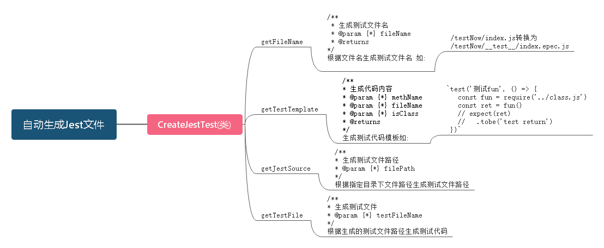
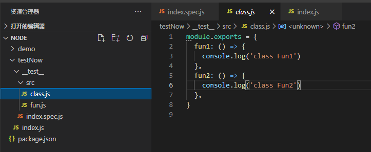

::: tip
随着近年来前端发展，全栈工程师的概念开始兴起，所谓全栈。即包括用户界面，业务逻辑，数据建模，服务器，网络及环境等。并且在大厂，nodeJs 也是一个必备的技能，因为语言特殊性都是使用 javascript，所有在开发成本上，大大降低了前端的门槛。
:::

<!-- more -->

## NodeJs 入门篇

### 一、编写单元测试 Jest 程序

1. 第一步 `npm install jest -g`
2. `__test__`文件夹中创建`index.spec.js` 文件
3. 文件规则[name].spec.js

```js
test('Hello World', () => {
	require('../index')
})
```

4. 为测试结果添加`断言`实现`测试驱动`

```diff
test('Hello World', () => {
  const result = require('../index')
- expect(result).toBe('Hello Wolrd')
})
```

5. 运行`jest [文件夹名] --watch`动态更新

### 二、手写一个自动生成 jest 测试文件

涉及的`Api`:

> #### fs
>
> 1. fs.existsSync // 根据路径判断文件是否存在
> 2. fs.mkdirSync // 根据路径创建文件夹
> 3. fs.readdirSync // 读取路径下的所有文件
> 4. fs.statSync([path]).isFile() // 判断文件的类型
> 5. fs.writeFileSync // 写入文件
> 6. fs.rmdirSync // 删除文件

> #### path
>
> 1. path.basename // 根据路径获取文件名
> 2. path.dirname // 获取目录名
> 3. path.extname // 获取文件的扩展名
> 4. path.format // 生成新的文件路径

详细文档：[nodeJs api](http://api.nodejs.cn/)

#### 实现思路



-   第一步手动创建`testNow`目录，新建`index.js`文件

```javascript
;-index.js

const path = require('path')
const fs = require('fs')
module.exports = class createTest {
	/**
	 * 生成测试文件
	 * @param {*} filePath
	 */
	getJestSource(filePath) {
		const testPath = filePath + '/__test__'
		if (!fs.existsSync(testPath)) {
			fs.mkdirSync(testPath)
		}
		console.log(filePath)
		// 遍历代码文件
		const list = fs.readdirSync(filePath)
		list
			// 添加完整路径
			.map((v) => `${filePath}/${v}`)
			// 过滤文件
			.filter((v) => fs.statSync(v).isFile())
			// 排除测试代码
			.filter((v) => v.indexOf('.spec') === -1)
			.map((v) => this.getTestFile(v))
	}
	getTestFile(fileName) {
		const testFileName = this.getFileName(fileName)
		if (fs.existsSync(testFileName)) {
			console.log('该文件已经存在', testFileName)
			return
		}
		const mod = require(fileName)
		let source
		if (typeof mod === 'object') {
			source = Object.keys(mod)
				.map((v) =>
					this.getTestSource(v, path.basename(fileName), true)
				)
				.join('\n')
		} else if (typeof mod === 'function') {
			const baseName = path.basename(fileName)
			source = this.getTestSource(baseName.replace('.js', ''), baseName)
		}
		fs.writeFileSync(testFileName, source)
	}
	/**
	 * 生成代码内容
	 * @param {*} methName
	 * @param {*} fileName
	 * @param {*} isClass
	 * @returns
	 */
	getTestSource(methName, fileName, isClass = false) {
		return `
      test('测试${methName}', () => {
            const ${
				isClass ? '{ ' + methName + ' }' : methName
			} = require('../${fileName}')
        const ret = ${methName}()
        // expect(ret)
        //   .tobe('test return')
      })
    `
	}
	/**
	 * 生成测试文件名
	 * @param {*} fileName
	 * @returns
	 */
	getFileName(fileName) {
		const dirName = path.dirname(fileName)
		const baseName = path.basename(fileName)
		const extName = path.extname(fileName)
		const testName = baseName.replace(extName, `.spec${extName}`)
		const fullName = path.format({
			root: dirName + '/__test__/',
			base: testName,
		})
		return fullName
	}
}
```

-   第二步在`testNow`文件夹下手动创建`__test__`目录新建`index.spec.js`文件

```javascript
;-index.spec.js

const fs = require('fs')
test('测试生成测试文件', () => {
	fs.rmdirSync(__dirname + '/src/__test__', {
		recursive: true,
	})
	const src = new (require('../index'))()
	const ret = src.getJestSource(__dirname + '/src')
	console.log('ret', ret)
})

// test('测试测试代码生成', () => {
// 	const src = new (require('../index'))()
// 	const ret = src.getTestSource('fun', 'class.js')
// 	expect(ret).toBe(`
//       test('测试fun', () => {
//             const fun = require('../class.js')
//         const ret = fun()
//         // expect(ret)
//         //   .tobe('test return')
//       })
//     `)
// })

// test('测试生成的文件名', () => {
// 	const createTest = new (require('../index'))()
// 	const fileName = createTest.getFileName('/testNow/index.js')
// 	expect(fileName).toBe('/testNow/__test__/index.spec.js')
// })
```

-   最后将需要自动生成的 `js`文件放到`__test__`文件夹下的 src 目录，如图所示
    

-   执行`jest testNow`第一个自动生成 jest 测试文件就成功拉

### 三、异步编程的 5 种方法

#### 什么是异步编程

-   JS 的执行环境是单线程(single thread)
-   I/O 处理需要回调函数异步处理(异步 I/O)
-   前端异步 IO 可以清楚 UI 阻塞，提高用户体验
-   而放在后端则可以提交 CPU 和内存利用率

#### 串联异步处理

1.  Callback
    > 由于 js 的执行环境是单线程，而执行异步代码时，是被跳过，需要等待异步返回执行结果时，再去执行异步的处理逻辑，如果想要让多个异步代码，按需执行，那么简单的方法就是使用 callBack 回调函数。

```js
exports.callback = () => {
	setTimeout(() => {
		logTime('callback 1')
		setTimeout(() => {
			logTime('callback 2')
		}, 100)
	}, 100)
}
```

2.  promise
    > promise 对象用于异步操作，它表示一个尚未完成且预计再未来完成的异步操作
    > 简单的说就是异步执行的状态机，异步执行的承诺。

```js
const promise = (name, delay = 100) =>
	new Promise((resolve) => {
		setTimeout(() => {
			logTime(name)
			resolve()
		}, delay)
	})

exports.promise = () => {
	promise('Promise 1')
		.then(promise('Promise 2'))
		.then(promise('Promise 3'))
}
```

3. Gennerator
    > ES6 新引入了 Gennerator 函数，可以通过 yield 关键字，把函数的执行流程挂起，为改变执行流程提供了可能，从而为异步编程提供解决方案
    >
    > - function => function\* 成为 gennerator 函数
    > - 函数内部有 yield 表达式

```js
exports.gennerator = () => {
	const gennerator = function*(name) {
		yield promise(name + 1)
		yield promise(name + 2)
		yield promise(name + 3)
	}
	const co = (gennerator) => {
		if ((it = gennerator.next().value)) {
			it.then((res) => {
				console.log(res)
				co(gennerator)
			})
		} else {
			return
		}
	}
	co(gennerator('genneratoGO '))
}
```

4. async/awit
    > async/awit 时 es7 推出的一套关于异步的终极解决方案
    >
    > - 任何一个 await 语句后面的 Promise 对象为 reject 状态，那么整个 aync 函数都会被中断执行
    > - async 函数返回的 Promise 对象，必须等内部所有的 await 命令后面的 Promise 对象执行完，才会发生状态改变，除非遇到 return 语句或者抛出错误，也就是说，只有 async 函数内部的异步操作执行完，才会执行 then 方法指定的回调函数。

```js
exports.asyncAwait = async () => {
	await promise('async await 1')
	await promise('async await 2')
	await promise('async await 3')
	await promise('async await 4')
}
```

5. 事件监听方式处理
    > 采用事件驱动模式，任何执行不取决于代码的顺序，而是取决某个事件是否发生。

```js
exports.emit = () => {
	const asyncFun = (name) => (event) => {
		setTimeout(() => {
			logTime(name)
			event.emit('end')
		}, 100)
		return event
	}
	const arr = [asyncFun('event 1'), asyncFun('event 2'), asyncFun('event 3')]
	const { EventEmitter } = require('events')
	const event = new EventEmitter()
	let i = 0
	event.on('end', () => i < arr.length && arr[i++](event))
}
```
